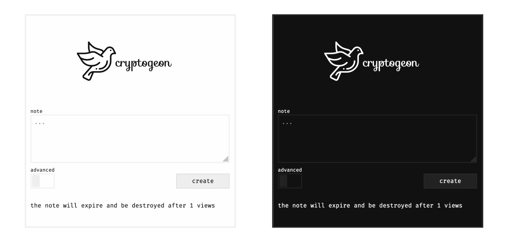

<p align="center">
  
</p>

<a href="https://discord.gg/nuby6RnxZt">
  
  
  
  
</a>

<br/>
<a href="https://www.producthunt.com/posts/cryptgeon?utm_source=badge-featured&utm_medium=badge&utm_souce=badge-cryptgeon" target="_blank"></a>
<br/>

## About?

_cryptgeon_ is a secure, open source sharing note service inspired by [_PrivNote_](https://privnote.com)

## Demo

Check out the demo and see for yourself https://cryptgeon.nicco.io.

## Features

- server cannot decrypt contents due to client side encryption
- view and time constraints
- in memory, no persistence
- obligatory dark mode support

## How does it work?

each note has a 512bit generated <i>id</i> that is used to retrieve the note. data is stored in memory and never persisted to disk.

## Screenshot



## Environment Variables

| Variable     | Default           | Description                                                                             |
| ------------ | ----------------- | --------------------------------------------------------------------------------------- |
| `MEMCACHE`   | `memcached:11211` | Memcached URL to connect to.                                                            |
| `SIZE_LIMIT` | `1 KiB`           | Max size for body. Accepted values according to [byte-unit](https://docs.rs/byte-unit/) |

## Deployment

ℹ️ `https` is required otherwise browsers will not support the cryptographic functions.

### Docker

Docker is the easiest way. There is the [official image here](https://hub.docker.com/r/cupcakearmy/cryptgeon).

```yaml
# docker-compose.yml

version: '3.7'

services:
  memcached:
    image: memcached:1-alpine
    entrypoint: memcached -m 128 # Limit to 128 MB Ram, customize at free will.

  app:
    image: cupcakearmy/cryptgeon:latest
    depends_on:
      - memcached
    ports:
      - 80:5000
```

### NGINX Proxy

See the [examples/nginx](https://github.com/cupcakearmy/cryptgeon/tree/main/examples/nginx) folder. There an example with a simple proxy, and one with https. You need to specify the server names and certificates.

### Traefik 2

Assumptions:

- External proxy docker network `proxy`
- A certificate resolver `le`
- A https entrypoint `secure`
- Domain name `example.org`

```yaml
version: '3.8'

networks:
  proxy:
    external: true

services:
  memcached:
    image: memcached:1-alpine
    restart: unless-stopped
    entrypoint: memcached -m 128 # Limit to 128 MB Ram, customize at free will.

  app:
    image: cupcakearmy/cryptgeon:latest
    restart: unless-stopped
    depends_on:
      - memcached
    networks:
      - default
      - proxy
    labels:
      - traefik.enable=true
      - traefik.http.routers.cryptgeon.rule=Host(`example.org`)
      - traefik.http.routers.cryptgeon.entrypoints=secure
      - traefik.http.routers.cryptgeon.tls.certresolver=le
```

## Development

1. Clone
2. run `pnpm i` in the root and and client `client/` folders.
3. Run `pnpm run dev` to start development.

Running `npm run dev` in the root folder will start the following things

- a memcache docker container
- rust backend with hot reload
- client with hot reload

You can see the app under [localhost:5000](http://localhost:5000).

###### Attributions

Icons made by <a href="https://www.freepik.com" title="Freepik">freepik</a> from <a href="https://www.flaticon.com/" title="Flaticon">www.flaticon.com</a>
